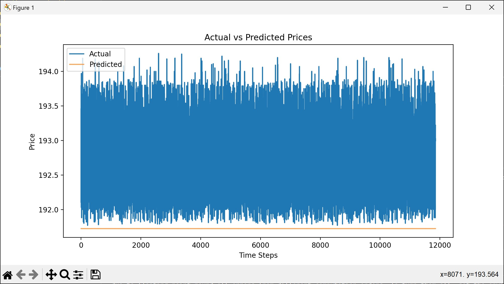
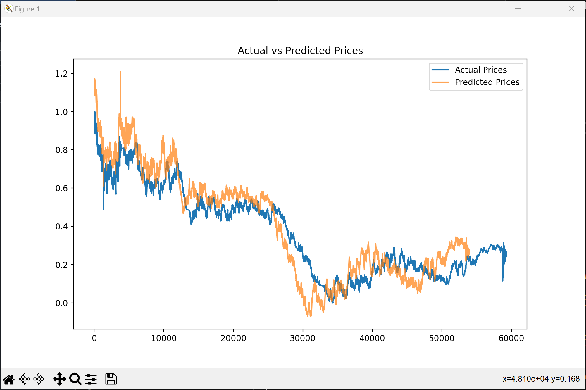
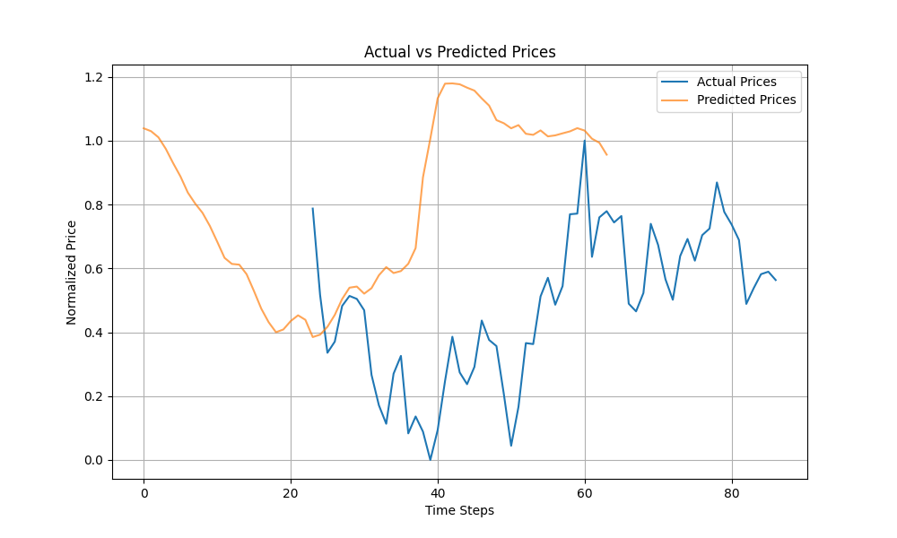
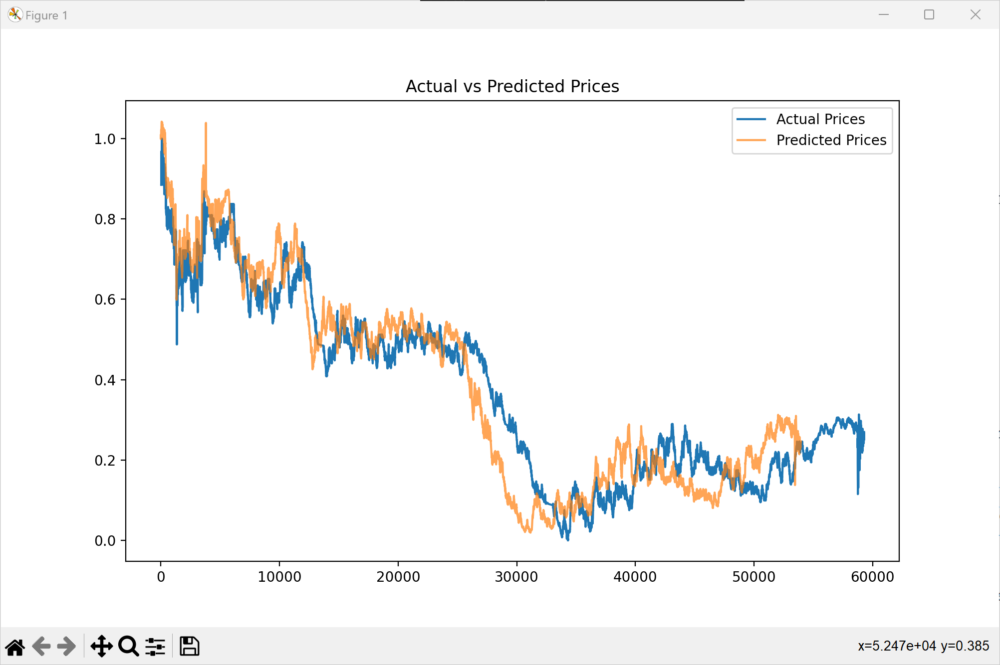
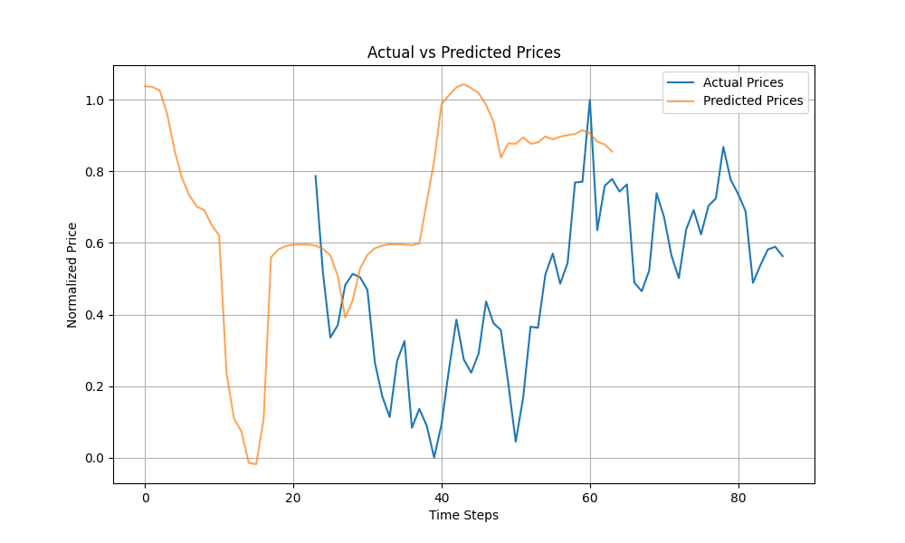
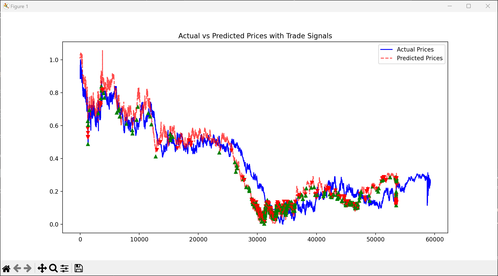
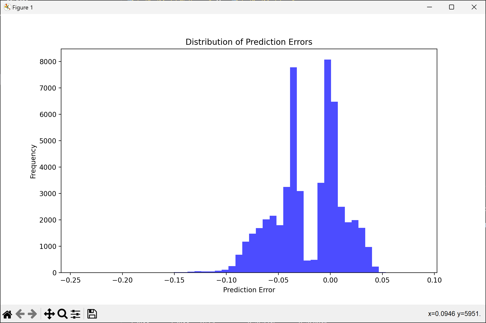
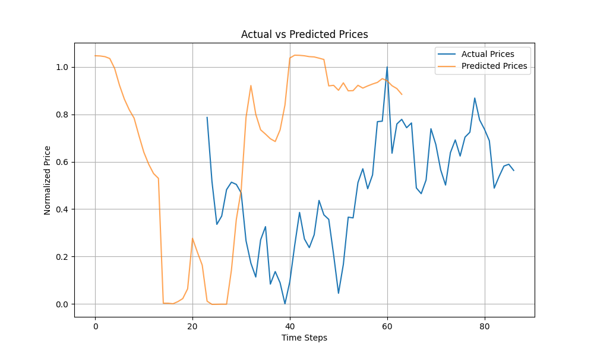

# Predictive Modeling for Stock Trading Signals

## Introduction
This repository hosts a machine learning project focused on developing and optimizing models to predict stock trading signals. The project explores various models, starting with LSTM and progressing to more sophisticated transformer models integrated with technical indicators. Our approach combines deep learning techniques with financial analytics to generate actionable trading signals.

## Project Overview
- **Objective**: Develop models that predict trading signals with high accuracy.
- **Data Source**: "xnas-itch-20230703.tbbo.csv" provided by Databento.
- **Models Used**: LSTM, Transformer.
- **Technical Indicators**: MACD, RSI, OBV.
- **Validation Technique**: K-fold cross-validation.
- **Tools**: Python, TensorFlow/Keras, Gradio for interactive visualization.

## Model Development and Results

### LSTM Model
The initial phase involved implementing a basic LSTM model to set a baseline. The model's performance was not satisfactory, prompting further exploration.

Initial Training result:



### Transformer Model with Technical Indicators
Transitioning to a transformer-based model augmented with technical indicators significantly improved prediction accuracy.
- **MAE**: `0.053994766458488885`
- **MSE**: `0.00431780060893947`

Training Result:



Result on dummy data:



Predictions:
```
Time Step	Action
11	Hold at
12	Hold at
13	Hold at
14	Hold at
15	Hold at
16	Sell at
17	Hold at
18	Hold at
19	Sell at
20	Sell at
21	Sell at
22	Hold at
23	Hold at
24	Hold at
25	Sell at
26	Sell at
27	Sell at
28	Sell at
29	Hold at
30	Buy at
```

### Optimized Transformer Model with K-Fold Validation
We employed a 5-fold cross-validation strategy to enhance the model's robustness, achieving our best results on the fourth fold.
- **MAE**: `0.028940385128486547`
- **MSE**: `0.0011381283422882674`

Training result:



Result on dummy data:



Predictions:
```
Time Step	Action
11	Hold at
12	Hold at
13	Sell at
14	Sell at
15	Sell at
16	Sell at
17	Hold at
18	Hold at
19	Sell at
20	Hold at
21	Sell at
22	Sell at
23	Sell at
24	Sell at
25	Sell at
26	Buy at
27	Buy at
28	Hold at
29	Hold at
30	Hold at

```

### Trading Blotter Integration
Further refinement was achieved by incorporating a trading blotter that simulated trading scenarios to assess the practical application of the predictions. This integration aimed to visualize potential profits and losses based on the model's signals, facilitating a realistic assessment of its trading utility.
- **MAE**: `0.02920279274869138`
- **MSE**: `0.0014783123259607437`

Training result:



Predictions Errors:



Result on dummy data:



Predictions:
```
Time Step	Action
11	Hold at
12	Hold at
13	Hold at
14	Hold at
15	Sell at
16	Sell at
17	Sell at
18	Hold at
19	Sell at
20	Sell at
21	Sell at
22	Sell at
23	Hold at
24	Sell at
25	Hold at
26	Sell at
27	Buy at
28	Buy at
29	Buy at
30	Buy at
```

## Gradio Application
We developed a Gradio app to interactively visualize predictions and compare them with actual prices. This tool allows users to upload their CSV files, receive predictions, and view recommended trading actions directly through an intuitive interface.

### Running the Application
To run the application, execute:
```bash
python gradioAPP.py
```
*Note: LSTM model won't run on this gradioAPP as it a .h5 file and the gradio app only supports only the models with .keras

